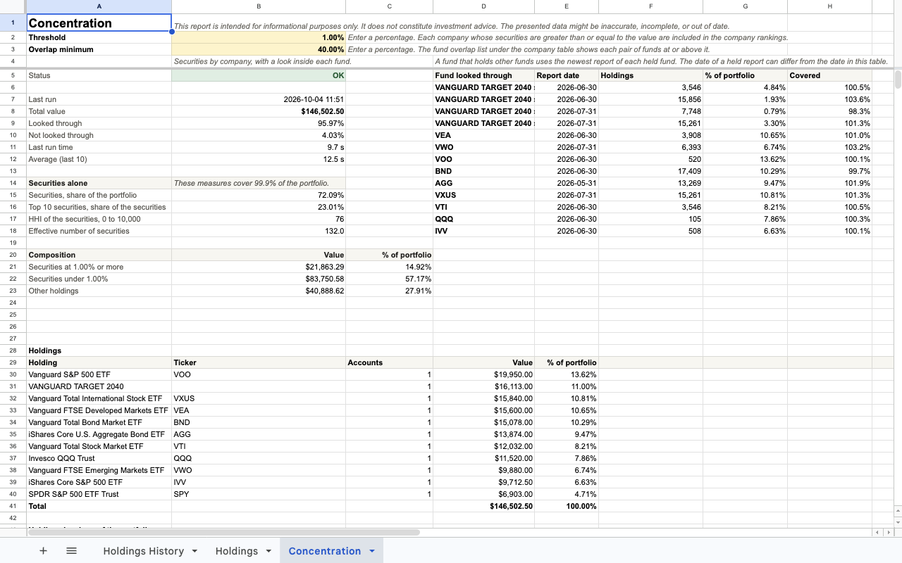
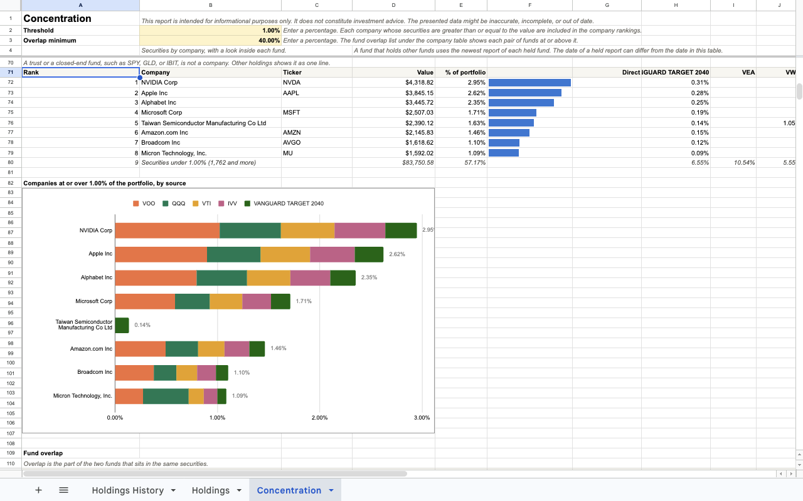
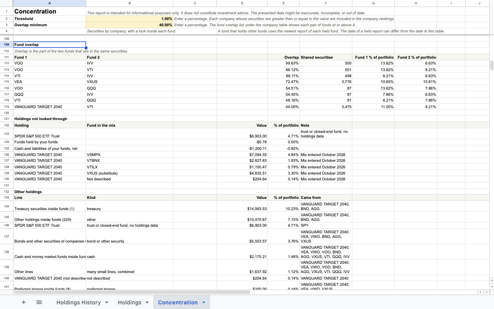
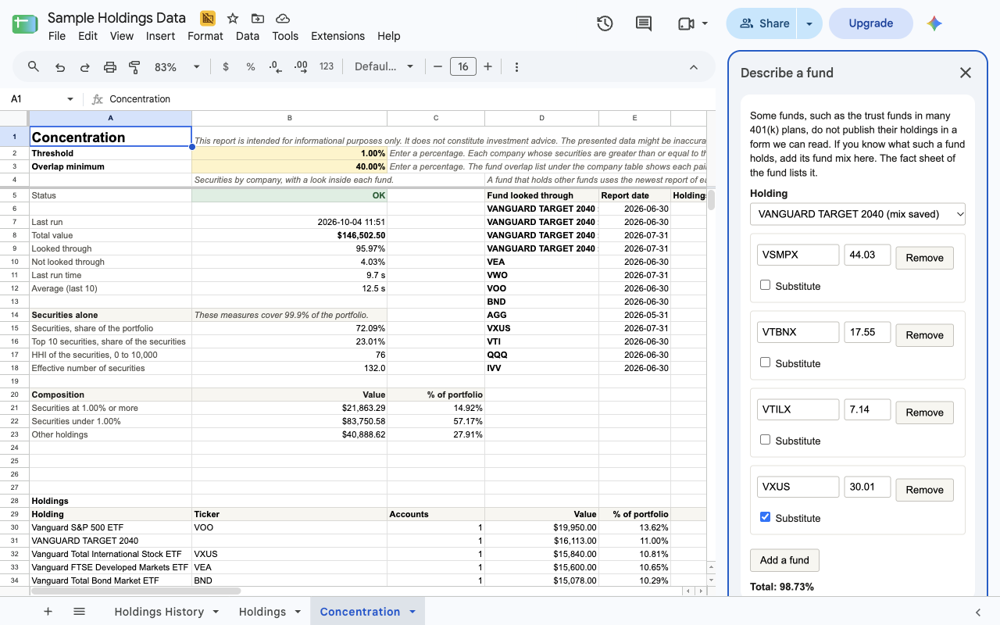

<p align="center">
  <a href="https://www.coopersbs.com">
    <picture>
      <source media="(prefers-color-scheme: dark)" srcset="assets/cooper-logo-primary-reversed.svg">
      <source media="(prefers-color-scheme: light)" srcset="assets/cooper-logo-primary.svg">
      
    </picture>
  </a>
</p>

# Holdings Concentration for Tiller

A Google Sheets Addon for Tiller Money that shows how much of the portfolio is concentrated in individual securities and
companies, after looking inside the funds.

Understanding the portfolio's concentration helps manage risk and make informed decisions about capital allocation. This
Addon does something a template-only solution cannot: it uses SEC filing data to know the composition of each fund, and
it recurses through funds that hold other funds, until it reaches the individual securities. That is how it can show
that an S&P 500 fund, a total market fund, and a target-date fund all hold the same company, and how much of the
portfolio is concentrated in that company.

Because the Addon uses the Holdings tab, it covers every account: different brokerages, different account types, and
even different owners, like a spouse's retirement account at another custodian.

## What the data shows

The Addon builds a **Concentration** tab. It provides data to answer the following questions:

1. **Where is capital allocated?** A breakdown of the portfolio by holding, grouped across accounts, with the number of
   accounts, the value, and the share of the portfolio. For example: what percentage of the portfolio is in the one
   target-date fund inside a 401(k)?
2. **How concentrated is the portfolio?** The Herfindahl-Hirschman Index (HHI) of the held securities, after recursing
   through the funds.
3. **How many securities does the portfolio effectively hold?** The effective number of securities, which is the inverse
   of HHI.
4. **How much concentration in individual securities does the portfolio have?** The value and the share of the portfolio
   in securities at or above the configured threshold (1% to start).
5. **Which companies contribute to the portfolio concentration?** A ranked table of every company at or above the
   threshold, with its value, its share of the portfolio, and how much of the concentration came from funds and direct
   holdings.
6. **How much do funds overlap?** For each pair of funds at or above a configured overlap minimum (10% to start), the
   part of the two funds that sits in the same securities. For example, how much of VOO and VTI overlap?

It also shows cash, bonds, Treasury securities, and other holdings inside the funds.

## How it works

The required calculations exceed what spreadsheet formulas can do alone, so the Addon is implemented as a Google Apps
Script, not a template. There is also no public, free API that has all the data these calculations need. To solve this,
our custom-built [Funds API](https://data.coopersbs.com) reads Form N-PORT portfolio reports filed with the U.S.
Securities and Exchange Commission (SEC) and serves them as JSON. The Funds API is its own offering, with an
[OpenAPI document](https://data.coopersbs.com/funds/v1/openapi.json) you can build against, but the Addon requires it to
function. A free API key is required to use the Funds API. You obtain the free key by signing up with a valid email
address. We may use your email for marketing as the business grows. You can unsubscribe from marketing emails and
continue using the API.

For each holding, the Google Apps Script sends a label, either the ticker symbol or the description when there is no
symbol, and a weight, where the weight is that holding's share of the portfolio's total. The request never includes a
dollar value, a share count, an account name, or the portfolio total. The API has no field for any of those. Every
dollar figure on the Concentration tab is calculated in the spreadsheet, from the Holdings tab.

### Funds of funds

When the Addon computes concentration, it recursively searches through funds that hold other funds, as many levels deep
as the filings go. Take Vanguard Target Retirement 2050 (VFIFX) for example. As of its June 2026 report, it holds four
other Vanguard funds:

| Held fund                 | Share of VFIFX |
| ------------------------- | -------------- |
| Total Stock Market Index  | 54%            |
| Total International Stock | 36%            |
| Total Bond Market II      | 7%             |
| Total International Bond  | 3%             |

The Total International Stock fund in turn holds a slice of the FTSE Emerging Markets fund, and the Addon looks through
that too. The result for a portfolio that is 100% VFIFX is about 15,000 lines, with NVIDIA on top at about 3.4% of the
portfolio, followed by U.S. Treasury notes and bonds. The Addon lists each fund it looked through, with the date of that
fund's report.

### What the data doesn't cover

The Funds API draws exclusively from SEC N-PORT filings. If a holding does not appear in the filings, the Addon cannot
analyze it. A common case is the collective investment trust in a 401(k) plan. Those trusts are not registered funds, so
they don't file a portfolio report. Some exchange-traded trusts, such as SPY, GLD, and IBIT, have no portfolio report in
the API either. The Addon lists each of these under **Holdings not looked through** or **Other holdings**.

For missing funds, common with trust funds, the Addon provides a **Describe a fund** sidebar where an equivalent fund or
holdings from the fund's prospectus can be entered manually. The Addon then looks through those funds in place of the
funds they were substituted for. The numbers are an approximation when a substitute fund is used.

### Data age

Form N-PORT data is not real-time. Fund managers file quarterly, and the filing is due 60 days after the end of the
quarter, so the data may be about 2 to 5 months old. The report shows the report date of each fund it looked through.

## Get a free API key

1. Go to [coopersbs.com/data](https://www.coopersbs.com/data/).
2. Enter your email address. Agree to the [Terms of Service](https://www.coopersbs.com/data/terms/), complete the
   visitor check, and click **Get my key**.
3. Copy the key and keep it somewhere safe.
4. Verify your email within 24 hours to keep the key active.
5. In your Tiller spreadsheet, choose **Extensions > Holdings Concentration for Tiller > Set API key** and paste the
   key.

Lost your key? Sign up again with the same email address.

## Describe a fund feature

For holdings that don't appear in the SEC filings, the Addon provides a **Describe a fund** feature. You can specify an
equivalent fund or enter the fund's holdings from its prospectus. To describe a fund, choose **Extensions > Holdings
Concentration for Tiller > Describe a fund**. Pick the holding, enter the ticker and the percent of each fund from its
fact sheet or prospectus.

## FAQ

**What is the Herfindahl-Hirschman Index (HHI), and what does the value mean?**

Take each security's share of the portfolio, square it, add the squares up, and multiply by 10,000. A portfolio that is
100% one stock scores 10,000. A portfolio spread evenly over 100 securities scores 100. A few large positions increase
the number non-linearly. For a sense of scale, an S&P 500 index fund on its own scores about 212, because the largest
companies carry so much of the index. There is no official "good" number for a portfolio. Use it as a comparison:
against last quarter, and against a broad index fund.

**What is the effective number of securities, and what does the value mean?**

It is 10,000 divided by the HHI. It answers: if my portfolio were spread evenly, how many securities would give me this
much concentration? An S&P 500 index fund holds about 500 companies but has an effective number of about 47, because the
top names dominate the index.

**Why does the report say "securities" instead of stocks, bonds, or funds?**

Because a fund holds all of those. When the report looks inside the funds it finds stocks, bonds, preferred shares,
derivatives, Treasury securities, cash, and other funds. "Securities" is the one word that covers what a company issues
and what comprises a fund. The company rankings and the HHI count stock only, so a bond from the same company does not
inflate a company's rank. The bonds and other securities are listed under **Other holdings**.

**Why are some ticker symbols missing?**

A Form N-PORT filing identifies a holding by name and other identifiers such as the LEI, the ISIN, and the CUSIP. A
ticker is not required. The Funds API maps identifiers to tickers from public sources, and when no source can resolve a
ticker, the ticker is left blank and the company's name is used in the entry. A foreign stock often has no U.S. ticker.
A company with more than one share class, such as Alphabet with GOOGL and GOOG, merges into one line by its LEI, so its
ticker cell is blank but its name and total are correct.

**Do I really need an API key?**

Yes. The key is free and only takes a minute to create. It lets us set a rate limit per key, so one runaway script
cannot take the service down for everyone else. It also tells us how many people use the service.

**Can you really not see the value of my portfolio? How can I verify this?**

1. Read the [OpenAPI document](https://data.coopersbs.com/funds/v1/openapi.json). The request body of
   `POST /funds/v1/concentration` has four fields: `id`, `ticker`, `parts`, and `weight`. None of them is a dollar
   amount, a share count, or an account. See the [Examples](#examples) section for an example prompt to have an AI agent
   check this for you (though never copy AI prompts from the internet).
2. Read the source. The function `buildPositions` in [`src/concentration.gs`](src/concentration.gs) builds every
   request. It divides each holding's value by the total and sends the result.

**Given that the Addon and the Funds API are free, how long can I expect them to be maintained?**

Best effort. Life changes, but we will do our best to maintain them for as long as we can. The Addon is open source
under the MIT license. If we ever have to shut down the Funds API, we will make a best effort to open source it too.

**What if I find the Addon useful and want to give something back?**

Word of mouth. If you know a small business owner who needs a bookkeeper, send them to
[coopersbs.com](https://www.coopersbs.com).

## Examples

### Call the concentration endpoint with curl

Replace `$KEY` with your API key. This portfolio is 60% VOO and 40% VTI.

```sh
curl -sS -X POST https://data.coopersbs.com/funds/v1/concentration \
  -H "Authorization: Bearer $KEY" -H "Content-Type: application/json" \
  -d '{"positions":[{"id":"a","ticker":"VOO","weight":0.6},{"id":"b","ticker":"VTI","weight":0.4}]}'
```

Response (truncated):

```json
{
  "measures": {
    "lineCount": 3507,
    "top10Weight": 0.359,
    "hhi": 189.1,
    "effectiveCount": 52.9,
    "lookedThroughWeight": 1.002,
    "notLookedThroughWeight": -0.002,
    "equity": { "weight": 0.998, "lineCount": 3477, "top10Weight": 0.362, "hhi": 191.7, "effectiveCount": 52.2 }
  },
  "funds": [
    { "ticker": "VOO", "name": "VANGUARD 500 INDEX FUND", "entered": true, "reportDate": "2026-06-30", "weight": 0.6 },
    {
      "ticker": "VTI",
      "name": "VANGUARD TOTAL STOCK MARKET INDEX FUND",
      "entered": true,
      "reportDate": "2026-06-30",
      "weight": 0.4
    }
  ],
  "overlaps": [{ "ids": ["a", "b"], "overlap": 0.881, "sharedLineCount": 501 }],
  "lines": [
    {
      "name": "NVIDIA Corp",
      "ticker": "NVDA",
      "class": "stock",
      "weight": 0.0705,
      "sources": { "a": 0.0451, "b": 0.0254 }
    },
    {
      "name": "Apple Inc",
      "ticker": "AAPL",
      "class": "stock",
      "weight": 0.063,
      "sources": { "a": 0.0395, "b": 0.0235 }
    },
    {
      "name": "Alphabet Inc",
      "ticker": null,
      "class": "stock",
      "weight": 0.0557,
      "sources": { "a": 0.035, "b": 0.0207 }
    }
  ]
}
```

VOO and VTI overlap by 88%. NVIDIA is 7.05% of this portfolio, with 4.51% coming through VOO and 2.54% through VTI. A
negative "not looked through" weight is normal: a fund report can list positions worth slightly more than 100% of the
fund with the difference shown as a liability.

### Have an AI agent confirm what the Addon sends

This is intended as a sample prompt only:

```text
Read the OpenAPI document at https://data.coopersbs.com/funds/v1/openapi.json.
List every field of the request body of POST /funds/v1/concentration, with its type and its description.
Tell me whether any field can carry a dollar amount, a share count, an account name, or a portfolio total.
```

## Screenshots

The top of the report: the status, the measures, the composition, and the funds looked through.



---

The company table and the company chart.



---

The fund overlap list, the holdings not looked through, and the other holdings inside the funds.



---

The Describe a fund sidebar, with a saved fund mix.



## Support

Ask a question or report an issue on the
[Issues](https://github.com/Cooper-Small-Business-Services/holdings-concentrations-addon/issues) tab of this repository.
Issues are public, so do not post your API key or portfolio details.

## About us

Cooper Small Business Services is a veteran-owned small business that provides bookkeeping services. We built this Addon
and the Funds API that powers it. Learn more at [www.coopersbs.com](https://www.coopersbs.com).

## License

MIT. See [LICENSE](LICENSE).

## Disclaimer

This Addon is for informational purposes only. It is not investment advice. The data comes from public SEC filings and
can be inaccurate, incomplete, or out of date.

Tiller Money is not affiliated with this Addon. Tiller does not make, endorse, or support it.
